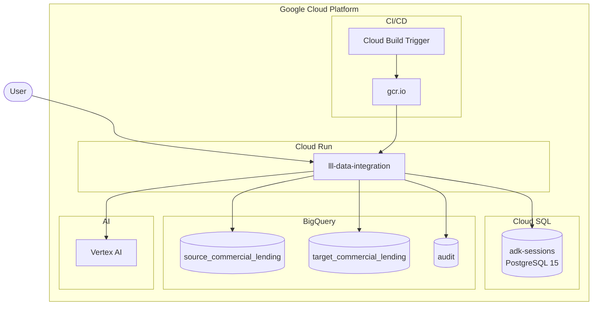
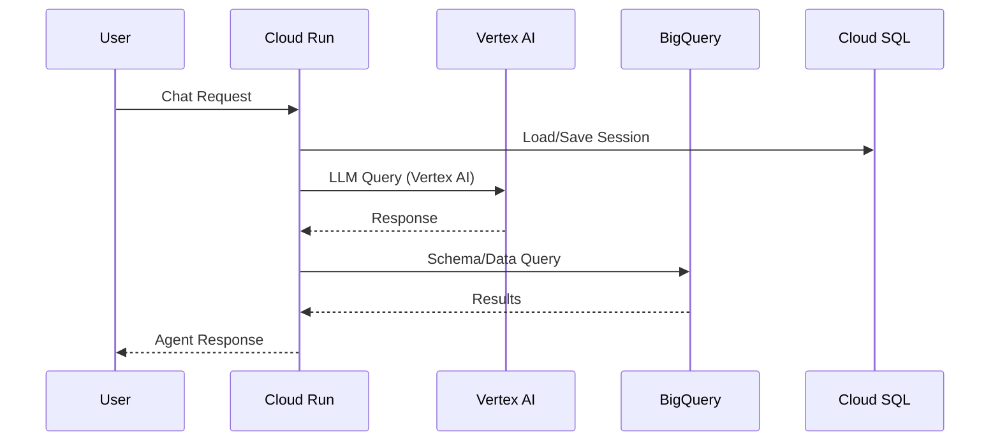

# Deployment Architecture

## GCP Project

- **Project ID**: `ccibt-hack25ww7-713`
- **Region**: `us-central1`

Source of truth for this page: `gcloud run services list/describe`.

---

## Architecture Diagram



---

## Deployed Resources

### Cloud Run (Services)

| Service | Primary URL | Image |
|---|---|---|
| `lll-data-integration` | https://lll-data-integration-417355809300.us-central1.run.app | `gcr.io/ccibt-hack25ww7-713/lll-data-integration:24bea54c7bc74b9e00b450c81f7b3780c34d2e2e` |


Console:
- https://console.cloud.google.com/run?project=ccibt-hack25ww7-713

Notes (from `gcloud run services describe lll-data-integration`):
- Service account: `417355809300-compute@developer.gserviceaccount.com`
- Env vars are configured via Secret Manager references (`BQ_*`, `GEMINI_MODEL`, etc.)
- Status reported `Ready=False` due to missing secret `AUDIT_LOG_DIR` (reason: `SecretsAccessCheckFailed`)

### Cloud SQL (Session Storage)
| Property | Value |
|----------|-------|
| Instance | `adk-sessions` |
| Type | PostgreSQL 15 |
| Connection | `ccibt-hack25ww7-713:us-central1:adk-sessions` |
| Console | [Open in Console](https://console.cloud.google.com/sql/instances/adk-sessions/overview?project=ccibt-hack25ww7-713) |

### BigQuery Datasets
| Dataset | Purpose | Console |
|---------|---------|---------|
| `source_commercial_lending` | Source dataset (deployment secret `BQ_DATASET_SOURCE`) | [Open](https://console.cloud.google.com/bigquery?project=ccibt-hack25ww7-713&d=source_commercial_lending) |
| `target_commercial_lending` | Target dataset (deployment secret `BQ_DATASET_TARGET`) | [Open](https://console.cloud.google.com/bigquery?project=ccibt-hack25ww7-713&d=target_commercial_lending) |
| `audit` | Audit dataset used by guardrails (code default) | [Open](https://console.cloud.google.com/bigquery?project=ccibt-hack25ww7-713&d=audit) |

### Cloud Build (CI/CD)
| Property | Value |
|----------|-------|
| Trigger | `lll-data-integration-cicd` |
| Console | [Open in Console](https://console.cloud.google.com/cloud-build/triggers?project=ccibt-hack25ww7-713) |

---

## Environment Variables

`lll-data-integration` pulls these from Secret Manager (values are not shown in `gcloud run services describe`):

- `GOOGLE_CLOUD_PROJECT`
- `GOOGLE_CLOUD_LOCATION`
- `GOOGLE_GENAI_USE_VERTEXAI`
- `BQ_PROJECT_ID`
- `BQ_DATASET_SOURCE`
- `BQ_DATASET_TARGET`
- `GEMINI_MODEL`
- `APP_PASSWORD`
- `AUDIT_LOG_DIR`

---

## Network Flow



---

## How to Reproduce (CLI)

```bash
gcloud run services list --project=ccibt-hack25ww7-713 --region=us-central1
gcloud run services describe lll-data-integration --project=ccibt-hack25ww7-713 --region=us-central1
gcloud sql instances describe adk-sessions --project=ccibt-hack25ww7-713
gcloud builds triggers describe lll-data-integration-cicd --project=ccibt-hack25ww7-713
gcloud artifacts repositories list --project=ccibt-hack25ww7-713 --location=us-central1
```
