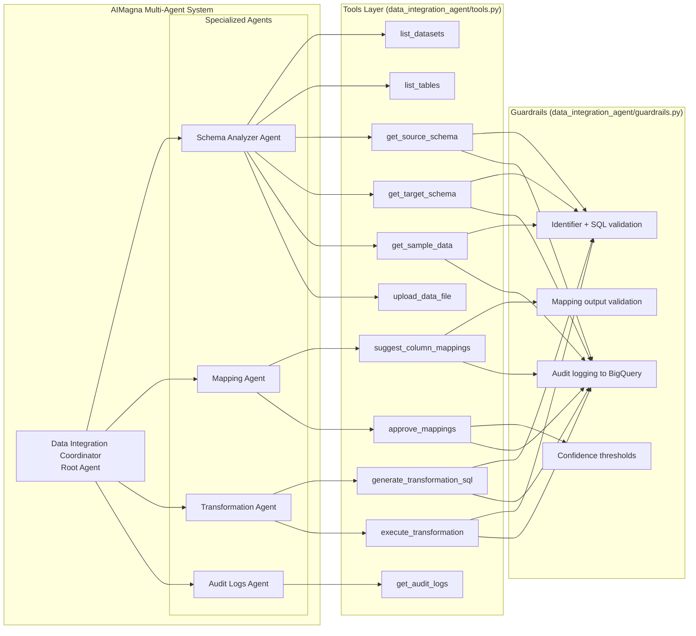
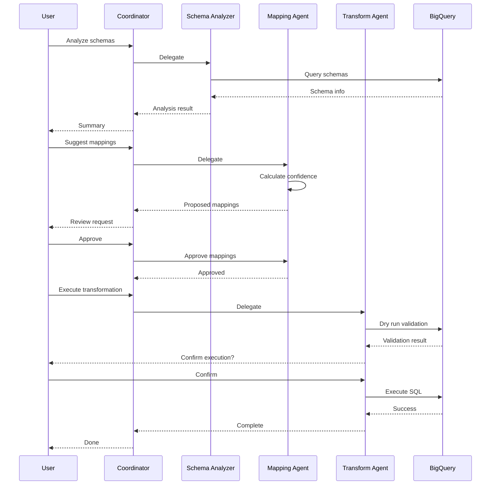

# Design

Technical design for the multi-agent data integration service (Google ADK + BigQuery + Vertex AI).

---

## Architecture



---

## Agents

| Agent | Purpose | Tools |
|-------|---------|-------|
| **Coordinator** | Routes tasks, orchestrates workflow | Delegates to sub-agents |
| **Schema Analyzer** | Schema + sampling | `list_datasets`, `list_tables`, `get_source_schema`, `get_target_schema`, `get_sample_data` |
| **Mapping Agent** | Proposes column mappings with confidence | `suggest_column_mappings`, `approve_mappings` |
| **Transformation Agent** | Generates and executes SQL | `generate_transformation_sql`, `execute_transformation` |
| **Audit Logs Agent** | Retrieves audit trail | `get_audit_logs` |

---

## Workflow Sequence



---

## Guardrails (Implementation)

- Guardrails are enforced in `data_integration_agent/guardrails.py` and called from tools in `data_integration_agent/tools.py`.
- Audit logging target table defaults to `${BQ_PROJECT_ID}.${BQ_AUDIT_DATASET}.audit_logs` (defaults: `BQ_AUDIT_DATASET=audit`, `BQ_AUDIT_TABLE=audit_logs`).

---

## Data Inputs

- Source and target datasets are user-provided (via tool inputs) with optional defaults from env vars.
- The repo ships sample schemas under `Sample-DataSet-CommercialLending/`.

---

## Tech Stack

| Component | Technology |
|-----------|------------|
| Agent Framework | Google ADK |
| LLM | Configured by env var `GEMINI_MODEL` (code default: `gemini-3-pro-preview`) |
| Data Warehouse | BigQuery |
| Session Storage | Cloud SQL (PostgreSQL 15) |
| Deployment | Cloud Run |
| CI/CD | Cloud Build |

---

## File Structure

```
data_integration_agent/
├── agent.py          # Agent definitions (coordinator + sub-agents)
├── tools.py          # Tool implementations (BigQuery operations)
├── guardrails.py     # Validation, logging, risk controls
├── server.py         # ADK web server
├── session_config.py # Cloud SQL session configuration
├── Dockerfile        # Container definition
└── requirements.txt  # Python dependencies
```

---

## Runtime Configuration

- `GEMINI_MODEL` defaults to `gemini-3-pro-preview` in `data_integration_agent/agent.py`.
- In Cloud Run, `GEMINI_MODEL` (and `BQ_*`, `APP_PASSWORD`) are injected via Secret Manager references.
