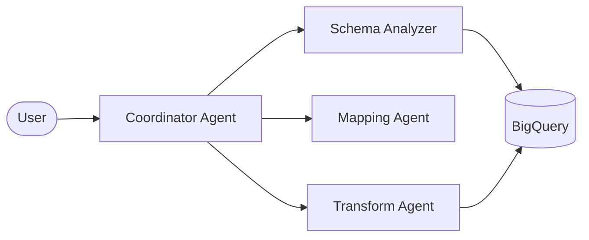

# AIMagna: Data Integration Agent (Technical)

---

## Slide 1: What This Service Is

- Google ADK multi-agent app for schema → mapping → SQL
- Backends: BigQuery (data + audit), Vertex AI (LLM)
- Frontend: ADK `/dev-ui/` behind a password gate

---

## Slide 2: Agent Topology

- Coordinator delegates to specialized agents
- Data-plane actions happen via tools (`data_integration_agent/tools.py`)

---

## Slide 3: Workflow (Tools)

1) `list_datasets`, `list_tables` (optional discovery)
2) `get_source_schema`, `get_target_schema`, `get_sample_data`
3) `suggest_column_mappings` → `approve_mappings`
4) `generate_transformation_sql` → `execute_transformation` (dry-run then run)
5) `get_audit_logs`

---

## Slide 4: Guardrails (Code-Enforced)

- Identifier + SQL validation (`data_integration_agent/guardrails.py`)
- Mapping output validation + confidence threshold checks
- Audit logging to BigQuery (default dataset `audit`, table `audit_logs`)

---

## Slide 5: Runtime Configuration

| Item | Source of Truth |
|---|---|
| Model | `GEMINI_MODEL` env var (code default `gemini-3-pro-preview`) |
| Datasets | `BQ_DATASET_SOURCE` / `BQ_DATASET_TARGET` env vars |
| Audit | `BQ_AUDIT_DATASET` default `audit` in code |
| Cloud Run env | Secret Manager refs in Cloud Run service spec |

---

## Slide 6: Demo (Technical)

- Obtain auth token (`POST /auth/login`)
- Upload file (`POST /api/upload`) and verify BigQuery load
- In `/dev-ui/`, run schema → mapping → SQL dry-run
- Inspect audit events (`get_audit_logs`)

---

*Source: repo code + live `gcloud run services describe` output*
